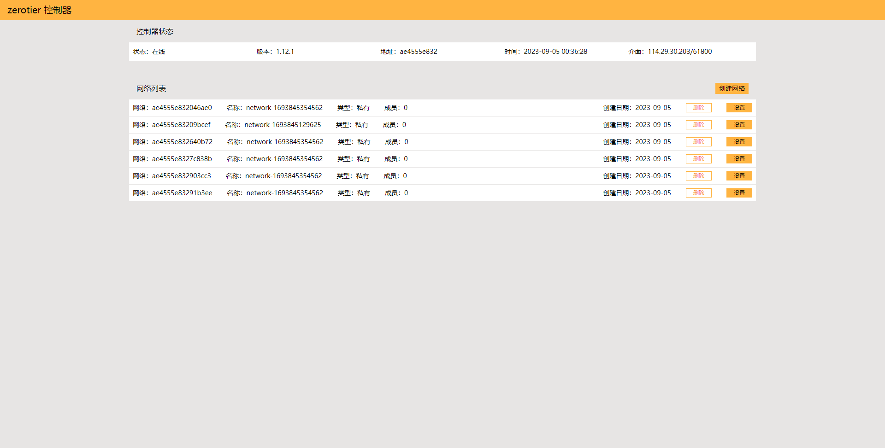
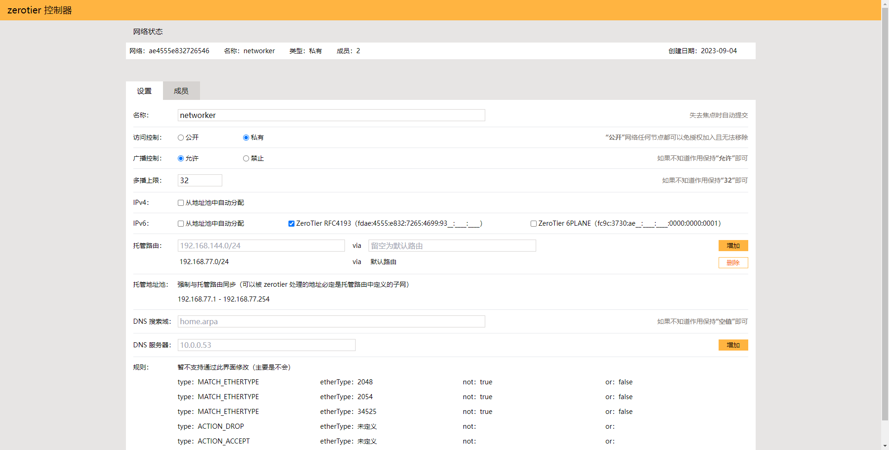
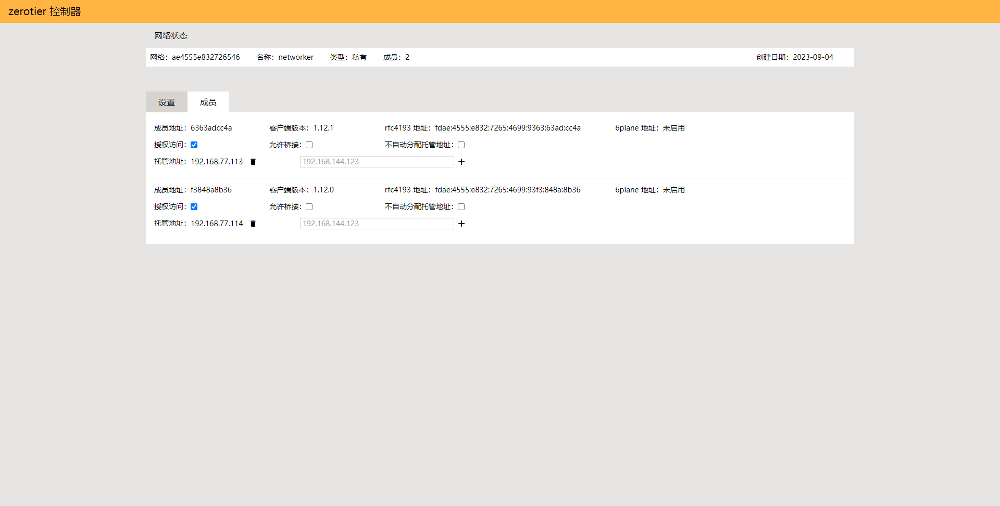

# ztocp
本地 zerotier-one 控制器的网页管理界面

### 想说的话
我的多个联机游戏群，包括但不限于 minecraft、7days2die、terraria 为代表的联机生存游戏，一提到联机都是 zerotier 组网，知道 tailscale 的都很少。

官方控制器给的设备限制数量实在太低了，而其它第三方控制器界面又实在难用，遂花 2 天时间自己撸了一个。

### 特性
- 相比于 ztncui 和 zero-ui 更合理和快速的界面
- 本质上只是个对接 zerotier controller API 的网页，对于动手能力强的人士来说玩法更多
- **不支持多用户**，因为从原理上无法只通过 zerotier controller API service 进行用户隔离，或者说所有用户都是管理员；如果有此类需求建议通过容器隔离多个实例来实现，9993 端口并不需要对外开放
- **托管地址池与托管路由强制同步**，因为不在托管路由中的 IP 地址无法通信；如果确实有分配无效 IP 的需求建议自行开发
- **不支持编辑 flow rules**，主要此功能极少用到；如果需要编辑可以直接修改本机文件
- 支持中文（幽默）

### 简易使用方式
> 尝试过直接使用环境变量生成配置，但是考虑到 HTTP 验证、TLS 证书、绑定域名等需求，最终还是直接暴露 caddy.json 配置文件，由用户自行决策。使用 caddy 的原因则是经过测试，在满足需求且有一定拓展性的情况下，caddy 是占用资源最少且镜像文件最小的。

创建容器，运行容器以生成配置文件，再停止容器
```shell
podman container create \
--name ztocp \
--network host \
--volume /usr/share/zoneinfo/Asia/Shanghai:/etc/localtime:ro \
--volume ztocp-caddy-config:/etc/caddy \
--env TZ=Asia/Shanghai \
docker.io/ragnaroks/ztocp:latest

podman start ztocp

podman stop ztocp
```

修改配置（ztocp-caddy-config/caddy.json），同目录的 Caddyfile 不用管
```js
// 对外服务监听地址
apps.http.servers.ztocp.listen[0] = "0.0.0.0:9994"

// zerotier API 端点
apps.http.servers.ztocp.routes[0].handle[0].upstreams[0].dial = "127.0.0.1:9993"

// HTTP BASIC 验证的用户名
apps.http.servers.ztocp.routes[0].handle[0].providers.http_basic.account[0].username = "username"

// HTTP BASIC 验证的密码，可以使用 https://bcrypt-generator.com/ 来生成
apps.http.servers.ztocp.routes[0].handle[0].providers.http_basic.account[0].password = "$2a$10$egkd8sE7eGclIohEJBYYr.9Ck3KKN2Zgiq7/7WpFUY/Ats.Mzt9ja"

// zerotier API authtoken，必须修改为对应实例的值，注意值为一个数组
// linux 位于 /var/lib/zerotier-one/authtoken.secret
// windows 位于 C:\ProgramData\ZeroTier\One\authtoken.secret
apps.http.servers.ztocp.routes[0].handle[1].headers.request.add['X-ZT1-AUTH'] = ["cgaydu2bb86joooaz8qwyj5p"]

// HTTP BASIC 验证的用户名，与上面保持一致
apps.http.servers.ztocp.routes[1].handle[0].providers.http_basic.account[0].username = "username"

// HTTP BASIC 验证的密码，与上面保持一致
apps.http.servers.ztocp.routes[1].handle[0].providers.http_basic.account[0].password = "$2a$10$egkd8sE7eGclIohEJBYYr.9Ck3KKN2Zgiq7/7WpFUY/Ats.Mzt9ja"
```

再次启动容器即可，可选由 systemd 托管
```shell
podman generate systemd --new --name ztocp > /etc/systemd/system/ztocp.service && systemctl daemon-reload && podman rm ztocp

systemctl enable --now ztocp
```

### 专业使用方式
打包静态文件，产出目录为 **.out**，由于 zerotier binary 不对跨域做正确处理且只接受来自 localhost 的请求，需要使用 caddy 或 nginx 同时解决托管网站和跨域问题
```shell
npm run build
```

参考此配置使用 caddy 承载
```json
{
  "admin":{
    "disabled":true
  },
  "apps": {
    "http": {
      "servers": {
        "ztocp": {
          "listen": ["0.0.0.0:9994"],
          "routes": [
            {
              "match":[
                {
                  "path":["/zerotier/*"]
                }
              ],
              "handle":[
                {
                  "handler":"authentication",
                  "providers":{
                    "http_basic":{
                      "hash":{
                        "algorithm": "bcrypt"
                      },
                      "accounts":[
                        {"username":"username","password":"$2a$10$egkd8sE7eGclIohEJBYYr.9Ck3KKN2Zgiq7/7WpFUY/Ats.Mzt9ja","salt":""}
                      ]
                    }
                  }
                },{
                  "handler": "reverse_proxy",
                  "transport":{
                    "protocol":"http",
                    "keep_alive":{
                      "enabled":true,
                      "probe_interval":30,
                      "max_idle_conns":2
                    }
                  },
                  "upstreams":[
                    {"dial":"127.0.0.1:9993"}
                  ],
                  "headers":{
                    "request":{
                      "add":{
                        "X-ZT1-AUTH":["cgaydu2bb86joooaz8qwyj5p"]
                      }
                    }
                  },
                  "rewrite":{
                    "strip_path_prefix":"/zerotier"
                  }
                }
              ]
            },{
              "match":[
                {
                  "path":["*"]
                }
              ],
              "handle":[
                {
                  "handler":"authentication",
                  "providers":{
                    "http_basic":{
                      "hash":{
                        "algorithm": "bcrypt"
                      },
                      "accounts":[
                        {"username":"username","password":"$2a$10$egkd8sE7eGclIohEJBYYr.9Ck3KKN2Zgiq7/7WpFUY/Ats.Mzt9ja","salt":""}
                      ]
                    }
                  }
                },{
                  "handler": "file_server",
                  "root":"/website/",
                  "index_names":["index.html"],
                  "canonical_uris":true,
                  "precompressed":{"br":{},"zstd":{},"gzip":{"level":1}}
                }
              ]
            }
          ],
          "automatic_https":{
            "disable":true
          }
        }
      }
    }
  }
}
```

或参考此配置使用 nginx 承载，注意 auth_basic_user_file 需要自行生成
```nginx
upstream upstream-zerotier {
  server                      127.0.0.1:9993;
  keepalive                   3;
}

server {
  listen                     9994;
  server_name                _;
  root                       /website/;
  gzip                       on;
  auth_basic                 authorize;
  auth_basic_user_file       /path/to/passwd;

  location /zerotier/ {
    proxy_http_version      1.1;
    proxy_pass              http://upstream-zerotier/;
    proxy_set_header        X-Real-IP $remote_addr;
    proxy_set_header        X-Forwarded-For $proxy_add_x_forwarded_for;
    proxy_set_header        Connection '';
  }

  location / {
    # 如果放在外面似乎会导致 /zerotier/ 的路由不正常
    index index.html;
  }
}
```

### 截图
|network list|config|member list|
|-|-|-|
||||