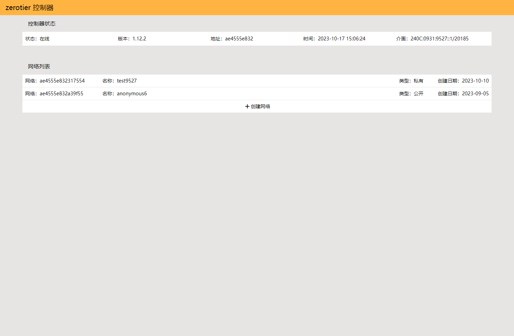
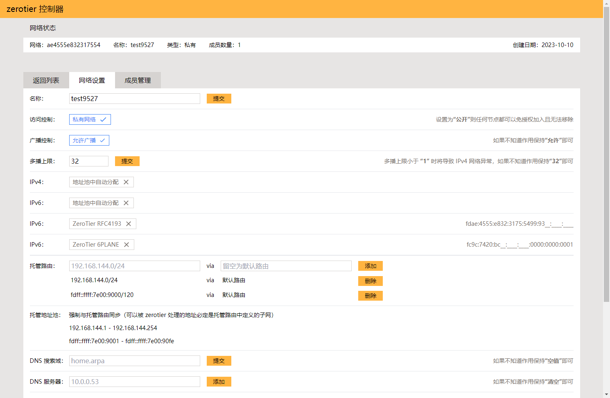
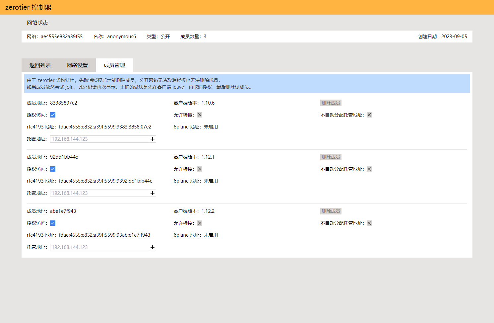

# ztocp
本地 zerotier-one 控制器的网页管理界面

### 想说的话
我的多个联机游戏群，包括但不限于 minecraft、7days2die、terraria 为代表的联机生存游戏，一提到联机都是 zerotier 组网，知道 tailscale 的都很少。

官方控制器给的设备限制数量实在太低了，而其它第三方控制器界面又实在难用，花一些时间自己撸了一个。

### 特性
- 相比于 ztncui 和 zero-ui 更合理和快速的界面
- **不支持多用户**，因为从原理上无法只通过 zerotier controller API service 进行用户隔离，或者说所有用户都是管理员；如果有此类需求建议通过容器隔离多个实例来实现，9993 端口并不需要对外开放
- **托管地址池与托管路由强制同步**，因为不在托管路由中的 IP 地址无法通信；如果确实有分配无效 IP 的需求建议自行开发
- **不支持编辑 flow rules**，主要此功能极少用到；如果需要编辑可以直接修改本机文件
- 支持中文（幽默）

### 简易使用方式
```shell
podman container create \
--name ztocp \
--network host \
--volume /usr/share/zoneinfo/Asia/Shanghai:/etc/localtime:ro \
--env TZ=Asia/Shanghai \
--env NEXT_TELEMETRY_DISABLED=1 \
--env ZEROTIER_ONE_ENDPOINT=http://localhost:9993 \
--env ZEROTIER_ONE_AUTHTOKEN=aaaabbbbccccddddeeeeffff \
--env ZTOCP_USERNAME=username \
--env ZTOCP_PASSWORD=password \
--env HOSTNAME=0.0.0.0 \
--env PORT=9994 \
docker.io/ragnaroks/ztocp:latest
```
可选由 systemd 托管
```shell
podman generate systemd --new --name ztocp > /etc/systemd/system/ztocp.service && systemctl daemon-reload && podman container rm ztocp

systemctl enable --now ztocp && podman logs --follow ztocp
```
|环境变量|默认值|说明|
|-|-|-|
|NEXT_TELEMETRY_DISABLED|1|关闭 NEXT.js 的数据窃取|
|ZEROTIER_ONE_ENDPOINT|http://localhost:9993|相对此容器而言 zerotier-one 接口的地址，如果容器运行在 host 网络下，则应当是 `http://localhost:9993`，其它情况请自行处理|
|ZEROTIER_ONE_AUTHTOKEN|aaaabbbbccccddddeeeeffff|zerotier-one 接口 token，windows 下位于 `C:\ProgramData\ZeroTier\One\authtoken.secret`，linux 下位于 `/var/lib/zerotier-one/authtoken.secret`|
|ZTOCP_USERNAME|username|面板用户名，**如果此项为空则会跳过用户认证**|
|ZTOCP_PASSWORD|password|面板密码，**如果此项为空则会跳过用户认证**|
|HOSTNAME|0.0.0.0|面板监听地址，如果使用 nginx 之类套一层的话建议设置为 127.0.0.1|
|PORT|3000|面板监听端口|

### 复杂使用方式
克隆项目并在本地运行 `npm run build` 后执行 `npm run start`，可创建 `.env.local` 文件放置环境变量

### 截图
|network list|network config|member list|
|-|-|-|
||||